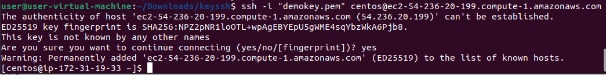
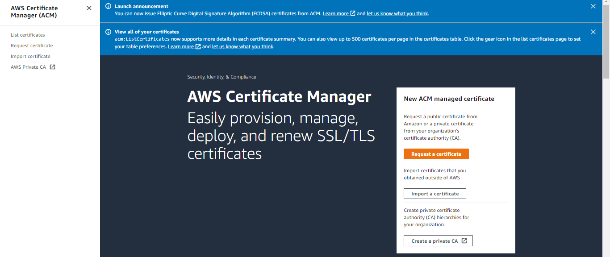
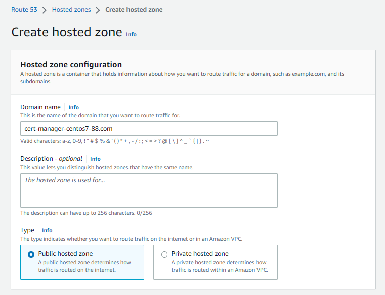

# Amazon Web Sevices

## Building NGINX Web Server With Terraform on AWS

•	Create IAM User

1. For security and audit reason, please avoid using root account. Just create Administrator user for daily task of sysadmin. I have already created Administrator user. Please note, allow programmatic access. Terraform can utilize this permmison to access AWS programmatically.
    
    

2. Attach this policy for your Administrator user.
    

3. After you create the user. You can get the access key id and secret id from Administrator user. You can add this one for login and access AWS programmatic from local PC. Don’t forget to create key pair for secure access to your ec2 instance. You can create this key pair at ec2 menu, then go to key pair.
    

4. And then click create key pair. As you can see, I already have created the key pair.
    

5. You can follow this option to create the key pair.
    

•	Using Terraform for Provision

6. Terraform is an infrastructure as code tool that lets you build, change, and version cloud and on-prem resources safely and efficiently (developer hashicorp). So we use this tools to provision amazon ec2 Centos 7 instances. Make sure you already install this tools in your local pc. For installation you can use this guide,
https://developer.hashicorp.com/terraform/tutorials/aws-get-started/install-cli
* Step 1,
Configure AWS CLI and provide the following information when prompted. This file used for authentication to access AWS programmatic with your credential IAM user. You can create this file with name “terraform.tfvars” in your local pc. Fill the aws_access_key and aws_secret_key with your credential. You can see this key from file after you created IAM user. 
Fill the key_name with your key pair name and call the file at private_key_patch.
    
* Step 2,
Create module.tf file for several configurations. We will configure variable, provider, data, security group resource and public dns output. Just follow this option to fill the file at modul.tf.
- Variable,
We declare what we create at terraform.tfvars and call the region what we want to use.
    
- Provider,
In this case, we user AWS to provison our ec2 instance.
    
- Data,
For specific request, I use centos 7 for guest OS to provision the ec2 instance.
    
- Security group,
We allow for specific protocol to access the ec2 like ssh, http and https port.
    
- Resource,
This function running to create the ec2 instance and security group what we created before based on configuration file.
    
- Output,
Last, we will display the public dns from ec2 instance. It can use for web server access. for this case, later we will use the nginx webserver after this configuration was launched.
    
* Step 3,
In this step, we will run the terraform file. Go to your terminal.
    
You can see, we already have the file in local pc. Now run this command to provison,
“terraform init”
    
“terraform validate”
    
“terraform plan”
    
“terraform apply”
    
Then write “yes” and click
    
Complete, and save the public dns.
“ec2-54-236-20-199.compute-1.amazonaws.com” -> we use this later for nginx access.
    

•	Check the Instance.

7. Go to the ec2 instance menu. You can see the instance was running.
    

•	Install the NGINX webserver.

8. Now we will install the nginx in the ec2 instance was we created. I use ssh connection login to the instance.
    
9. After login, we create bash script on centos to automate the installation.
    
10. Create “webserver.sh” file in the centos.
    
11. Then open it with vi (you can use nano/vim, etc) to fill the command.
    
12. Then fill this command, then save.
    
13. Re-checked the file.
    
14. Now edit the file gonna be execute.
    
15. Now run the script. Wait until finished.
    
16. The script was done. 
    
17. Now, we checked the nginx. As you can see, it was running.
    
18. Then, we test to access nginx webserver with public dns.
“ec2-54-236-20-199.compute-1.amazonaws.com” 
    
19. Great, it was successfully. But look at that, this url have not secure access, because we not yet set the ssl certificate to this url. 
Next, let’s go set the certificate for this access. go to the aws certificate manager. Then click request certificate.
    
20. Click next,
    
21. Follow this option, 
    
22. then click request.
    
23. You must have wait for several minute, because it need approval from AWS.
    
24. “I don’t completely show you when the certificate was done. Because it might take a long time, so you must wait for this, then I just show to you how to configure the ssl/tls certification for your webserver”.
Now we go to Route 53 to set the record. 
    
25. Then click create hosted zone.
    
26. Zone was created.
    
    
27. Now we must create the distribution on cloudfront service. Go to cloudfront and create.
    
28. Follow this option to create the setting. Just fill below the picture.
    
29. Fill the certificate.
    
30. Then click create distribution.
    
31. Edit the distribution.
    
    
32. Then add your alternative domain. Click save changes.
    
33. Go back to route 53, then create a record.
Choose the route traffic with cloudfront. Then click create record.
    
34. After a minute, just refresh the browser with “cert-manager-centos7-88.com” domain name.
Done. Thanks
